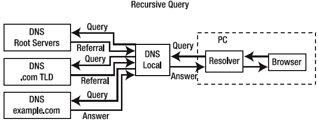
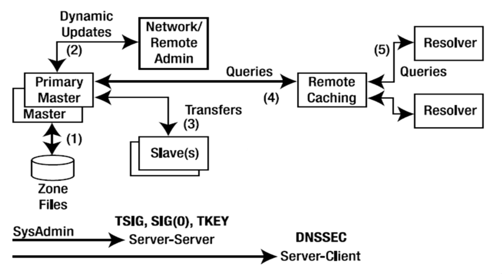
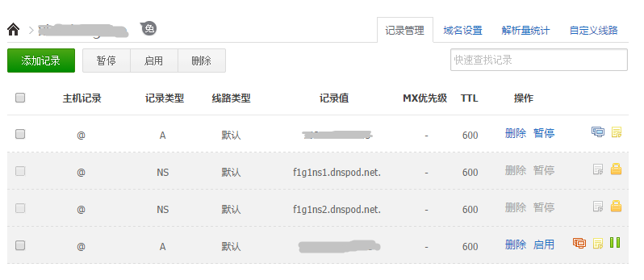

title: DNS 网络策略优化研究
author:
  name: xiazdong
  url: http://xiazdong.me
  email: xiazdong@126.com
output: index.html
controls: true
style: style.css

--

# DNS网络策略优化研究
## 2015-6-30

--

### 背景

- 网络质量探测工具
- Cracking the code interview：[当你在浏览器中输入一个URL，并按下 Enter后都发生了什么？](http://www.hawstein.com/posts/17.1.html)
- Github 仓库：[what-happens-when-zh_CN](https://github.com/skyline75489/what-happens-when-zh_CN)

-- 

### 基本概念

- DNS(Domain Name System, 域名系统)：互联网基础设施。1983 年由 Paul Mockapetris 设计。
- DNS 负责域名解析，即将域名翻译成 IP 地址。

	

- Zone: 一棵子树。 比如 "www.taobao.com" 处于 ".com" 的 Zone 中。
- Domain: 树中到根的一条路径。比如 "taobao.com." 是一个 Domain。

--

### 域名

- 根域名(Root Domain)：即"."。共13个根域名服务器(每个根域名服务器都是一个集群，通过 AnyCast 技术共用一个 IP)，分别为 "[A-M].root-servers.net"。
- 顶级域名(Top Level Domain, TLD)
	+ gTLD(generic TLD, 国际顶级域名): 比如 .com, .net。
	+ ccTLD(country code TLD, 国家和地区顶级域名): 比如 .cn, .jp。
- 二级域名(Second Level Domain): 比如 "taobao.com"。
- ...

--

### 根域名服务器分布

 

	

--

### Local DNS(LDNS)

- 如果电脑上网设置为 DHCP，则电脑的 LDNS 是网络服务提供商(ISP)自动分配的，一般分配两个 LDNS，作为主 DNS 和备份 DNS。
- LDNS 是 ISP 自己维护的。
- 用户也可以自行设定，比如 [AliDNS](http://www.alidns.com/) 或 其他公共 DNS。
- Root DNS 的 13个服务器的 IP 是公开的，因此以静态文件存储在 LDNS 上。

> 查看 LDNS IP 和设备的外网 IP，可以使用阿里的昆仑镜或者腾讯的华佗。

--

### LDNS 域名解析流程

 

	

--

### DNS 分类

- 递归 DNS： 负责接收域名解析请求，并帮助用户一次又一次递归地请求不同的 DNS 服务器，最后将 IP 返回给用户。比如 LDNS。
- 权威 DNS： 保存某个域 DNS 解析的权威信息，怎么解析他说了算。需要在上一级 DNS 服务器的 Zone File 中设置下一级的权威 DNS。

一个 DNS 服务器既可以作为递归 DNS，又可以作为权威 DNS。

--

### 权威 DNS 案例

- 在 Godaddy 购买域名之后，默认域名的权威 DNS 是 Godaddy 自己的 DNS 服务器。
- 如果现在想修改域名的权威 DNS，则需要在 Godaddy 中修改 Nameserver，比如设置为 DNSPod 的 "f1g1ns1.dnspod.net" 和 "f1g1ns2.dnspod.net"。

--

### DNS Zone File

	$ORIGIN example.com.     ; designates the start of this zone file in the namespace
	$TTL 1h                  ; default expiration time of all resource records without their own TTL value
	example.com.  IN  SOA   ns.example.com. username.example.com. ( 2007120710 1d 2h 4w 1h )
	example.com.  IN  NS    ns                    ; ns.example.com is a nameserver for example.com
	example.com.  IN  NS    ns.somewhere.example. ; ns.somewhere.example is a backup nameserver for example.com
	example.com.  IN  MX    10 mail.example.com.  ; mail.example.com is the mailserver for example.com
	@             IN  MX    20 mail2.example.com. ; equivalent to above line, "@" represents zone origin
	@             IN  MX    50 mail3              ; equivalent to above line, but using a relative host name
	example.com.  IN  A     192.0.2.1             ; IPv4 address for example.com
	          	IN  AAAA  2001:db8:10::1        ; IPv6 address for example.com
	ns            IN  A     192.0.2.2             ; IPv4 address for ns.example.com
          		IN  AAAA  2001:db8:10::2        ; IPv6 address for ns.example.com
	www           IN  CNAME example.com.          ; www.example.com is an alias for example.com
	wwwtest       IN  CNAME www                   ; wwwtest.example.com is another alias for www.example.com
	mail          IN  A     192.0.2.3             ; IPv4 address for mail.example.com
	mail2         IN  A     192.0.2.4             ; IPv4 address for mail2.example.com
	mail3         IN  A     192.0.2.5             ; IPv4 address for mail3.example.com

资源记录(Resource Record)类型：

- SOA(Start Of Authority): 设置起始授权服务器，管理员邮箱。
- NS(Name Server): 设置授权服务器的地址。
- A/AAAA(Address)：设置域名的 IPv4/IPv6 地址。
- CNAME：设置域名的别名。
- MX(Mail eXchange)：设置邮件服务器。

--

### Zone File 更新策略

 

	

--

### DNSPod

 

	

--

### 域名解析全过程

1. 查看浏览器 DNS 缓存。("chrome://net-internals/#dns")
2. 查看系统 DNS 缓存。("ipconfig /displaydns", "ipconfig /flushdns")
3. 查看路由器 DNS 缓存。
4. 查看 Local DNS 的 DNS 缓存。
5. 如果这些缓存都没有域名对应的IP，那么 Local DNS 会帮你递归地开始进行域名解析。

--

### dig 命令

dig(Domain Information Groper): 域名解析工具。

执行 "dig +trace taobao.com" 的输出：

	; <<>> DiG 9.8.3-P1 <<>> +trace taobao.com
	;; global options: +cmd
	.           84725   IN  NS  l.root-servers.net.
	.           84725   IN  NS  j.root-servers.net.
	.           84725   IN  NS  c.root-servers.net.
	.           84725   IN  NS  f.root-servers.net.
	.           84725   IN  NS  i.root-servers.net.
	.           84725   IN  NS  k.root-servers.net.
	.           84725   IN  NS  h.root-servers.net.
	.           84725   IN  NS  e.root-servers.net.
	.           84725   IN  NS  m.root-servers.net.
	.           84725   IN  NS  a.root-servers.net.
	.           84725   IN  NS  g.root-servers.net.
	.           84725   IN  NS  b.root-servers.net.
	.           84725   IN  NS  d.root-servers.net.
	;; Received 505 bytes from 10.65.0.1#53(10.65.0.1) in 159 ms
	;上面这些数据是从 /etc/resolv.conf 中指定的 DNS 服务器(IP 地址为 10.65.0.1)获得的13个根域名服务器的 IP 地址和名称。

--

### dig 命令(Cont.)
	
	com.            172800  IN  NS  a.gtld-servers.net.
	com.            172800  IN  NS  b.gtld-servers.net.
	com.            172800  IN  NS  c.gtld-servers.net.
	com.            172800  IN  NS  d.gtld-servers.net.
	com.            172800  IN  NS  e.gtld-servers.net.
	com.            172800  IN  NS  f.gtld-servers.net.
	com.            172800  IN  NS  g.gtld-servers.net.
	com.            172800  IN  NS  h.gtld-servers.net.
	com.            172800  IN  NS  i.gtld-servers.net.
	com.            172800  IN  NS  j.gtld-servers.net.
	com.            172800  IN  NS  k.gtld-servers.net.
	com.            172800  IN  NS  l.gtld-servers.net.
	com.            172800  IN  NS  m.gtld-servers.net.
	;; Received 488 bytes from 128.63.2.53#53(128.63.2.53) in 275 ms 
	;上面这些数据是从13个根域名服务器的其中一个(IP 地址 128.63.2.53)获得 ".com" 的 DNS 服务器的 IP 地址和名称。
	
	taobao.com.     172800  IN  NS  ns4.taobao.com.
	taobao.com.     172800  IN  NS  ns5.taobao.com.
	taobao.com.     172800  IN  NS  ns6.taobao.com.
	taobao.com.     172800  IN  NS  ns7.taobao.com.
	;; Received 180 bytes from 192.26.92.30#53(192.26.92.30) in 279 ms
	;上面这些数据是从13个".com" DNS 服务器的其中一个(IP 地址 192.26.92.30)获得 "taobao.com" 的 DNS 服务器的 IP 地址和名称。
	
	taobao.com.     1800    IN  A   110.75.115.70
	taobao.com.     10800   IN  NS  ns7.taobao.com.
	taobao.com.     10800   IN  NS  ns5.taobao.com.
	taobao.com.     10800   IN  NS  ns4.taobao.com.
	taobao.com.     10800   IN  NS  ns6.taobao.com.
	;; Received 196 bytes from 110.75.38.29#53(110.75.38.29) in 3 ms
	;上面这些数据是从4个"taobao.com"的 DNS 服务器的其中一个(IP 地址为 110.75.38.29)获得 "taobao.com" 的 IP 地址：110.75.115.70。

--

### DNS 安全

- DNS 劫持(DNS Hijacking or DNS redirection)：攻击者劫持 DNS 服务器，篡改映射关系。比如运营商广告劫持。
- DNS 污染(DNS cache poisoning)：攻击者修改 DNS 服务器缓存的映射关系。
- 分布式拒绝服务(DDOS, Distributed Deny Of Service)：搞一堆肉机，制造大量域名解析请求，导致权威 DNS(或 LDNS)的带宽被塞满。

--

### DNS 劫持案例

详见：<http://weibo.com/p/1001603858043396881002>

--

### 无线端域名解析优化

HttpDNS(IP直连):

- 异步: 开辟新线程向HttpDNS服务器发起HTTP域名解析请求。
- 缓存: 将解析的结果缓存在客户端，下次免去域名解析过程。
- 降级: 若缓存不存在，则走 LDNS。

--

### HttpDNS

 

--

# 谢谢